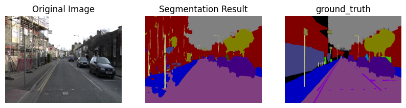
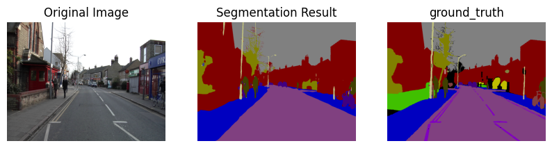

# VGG-Unet
Unet segmentation model with VGG16 as backbone

# Quick start
1. run data preprocess file `datapreprocess.py` to convert RGB masks to numpy format files(.npy files).
2. run the .ipynb file, follow the instructions in it.
3. ideal result may be like    
# Attention
1. Files under the directory shoule be arranged like this:   
  root/   
  ├── data/   
  |   ├── test   
  |   ├── testannot   
  │   ├── train   
  │   ├── trainannot   
  │   └── train_numpy   
  ├── datapreprocess.py   
  ├── \<ipynb file\>   
  └── README.md   

2. the `color_map` in `datapreprocess.py` should be set corresponding to the dataset.
